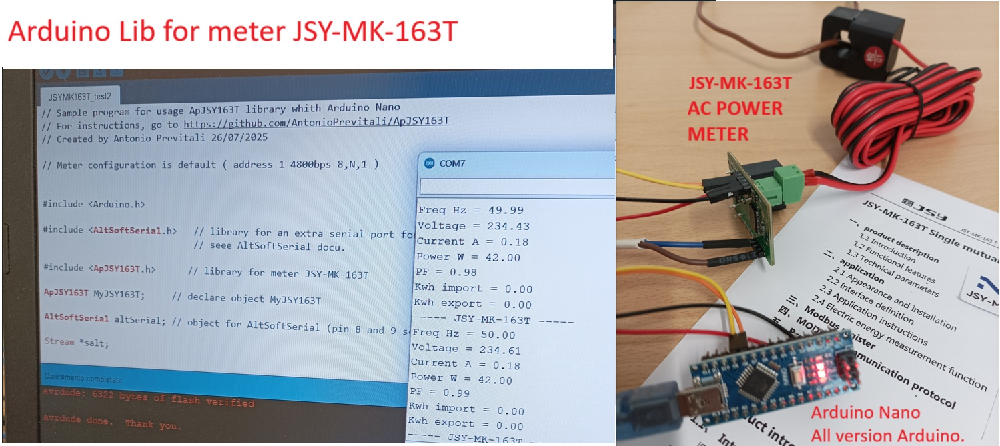

# ApJSY163T
Library for interfacing meter JSY-MK-163T with Arduino

Specific to model JSY-MK-163T, it uses a direct approach to the meter without the need to know the Modbus protocol.



## Getting Started

very simple !

```c++

// Sample program for usage ApJSY163T library whith Arduino Nano
// For instructions, go to https://github.com/AntonioPrevitali/ApJSY163T
// Created by Antonio Previtali 26/07/2025

// Meter configuration is default ( address 1 4800bps 8,N,1 )


#include <Arduino.h>

#include <AltSoftSerial.h>   // library for an extra serial port for arduino nano.
                             // seee AltSoftSerial docu.

#include <ApJSY163T.h>      // library for meter JSY-MK-163T

ApJSY163T MyJSY163T;       // declare object MyJSY163T

AltSoftSerial altSerial;   // object for AltSoftSerial (pin 8 and 9 seee AltSoftSerial docu)
                           // you can also use SoftSerial or hardware serial Serial1,n

void setup() {
       
    Serial.begin(9600);    // serial monitor console at 9600 bps
    while(!Serial){};
    delay(200); 

    altSerial.begin(4800);               // default speed of meter.
    MyJSY163T.UseSerial(&altSerial);     // pass stream to use at library.
    delay(200);   // a bit of time to start altSerial (NOT REMOVE, TEST)
    
}


void loop() {
 

    if ( MyJSY163T.okReadMeter() )
    {
      Serial.println("----- JSY-MK-163T -----");
      Serial.print("Freq Hz = ");
      Serial.println(MyJSY163T.Frequency);
      Serial.print("Voltage = ");
      Serial.println(MyJSY163T.Voltage);      
      Serial.print("Current A = ");
      Serial.println(MyJSY163T.Current);
      Serial.print("Power W = ");
      Serial.println(MyJSY163T.Power);
      Serial.print("PF = ");
      Serial.println(MyJSY163T.PowFact);     
      Serial.print("Kwh import = ");
      Serial.println(MyJSY163T.Import);
      Serial.print("Kwh export = ");
      Serial.println(MyJSY163T.Export);  
    }
    else  Serial.println("Error reading meter");
   

    delay(1000);  // time for human reading
}
```
```
Output is:
----- JSY-MK-163T -----
Freq Hz = 50.00
Voltage = 234.61
Current A = 0.18
Power W = 42.00
PF = 0.99
Kwh import = 0.00
Kwh export = 0.00
-----------------------
```
## For further information see the doc folder

## here is the website of the manufacturer of these good meters https://www.jsypowermeter.com/

here is a video of my test https://youtube.com/shorts/E0PEXRELhN8

